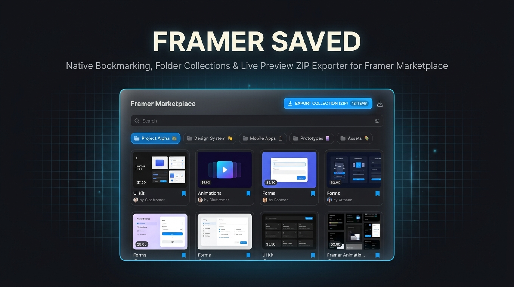

<div align="center">



# 🔖 Framer Saved

### *Native Bookmarking, User Collections & Live Preview ZIP Exporter for Framer Marketplace*

[](https://chrome.google.com/webstore)
[](./test)
[](./LICENSE)
[](#privacy--architecture)

<p align="center">
  <b>Framer Saved</b> bridges the gap in the Framer Marketplace by adding robust <b>bookmarking</b>, <b>custom folder collections</b>, a native <b>Saved</b> sidebar tab, and <b>one-click Live Preview export (HTML/CSS/JS ZIP)</b> — all seamlessly integrated into Framer's dark design system with playful spring micro-animations.
</p>

[✨ Key Features](#-key-features) • [📦 Live Preview ZIP Exporter](#-live-preview-export-htmlcssjs-zip) • [🚀 Installation](#-installation) • [⌨️ Hotkeys](#%EF%B8%8F-hotkeys) • [🛠 Development](#-development)

</div>

---

## ✨ Key Features

| Feature | Description |
| :--- | :--- |
| **🔖 Sidebar Saved Tab** | Injects a native-looking `Saved` tab with a real-time badge count right under Community navigation. |
| **📁 Custom User Collections** | Create, rename, and delete unlimited custom folders (e.g. `Minimalist`, `Dark UI`, `3D & Motion`, `Interactions`). Add items to multiple folders instantly. |
| **📌 Inline Card & Detail Bookmarks** | Save components from any tile card thumbnail (top-left button) or detail page header with tactile press feedback and spring pop animations. |
| **📦 1-Click Live Preview ZIP Exporter** | Extract complete offline-ready components (`index.html` + JS/CSS/assets ZIP archive) straight from Live Previews. |
| **🔗 Folder Link Exporter** | Export/copy all URLs from any selected folder to clipboard and download them as a `.txt` list with one click. |
| **🔀 Sorting & Instant Search** | Sort by *Newest*, *Oldest*, *Title A→Z*, or *Price*. Filter by query with live instant grid rendering. |
| **⚙️ Customization Panel** | Settings drawer to toggle export parameters (strip analytics, static vs interactive JS, auto-scroll), hotkeys, and JSON backup import/export. |
| **✨ Playful Micro-Animations** | Fluid spring physics on button press, elastic popover pop, wiggle icon toasts, and card cascade entrances. |

---

## 📦 Live Preview Export (HTML/CSS/JS ZIP)

Click the **Export** button on any component detail page or card hover preview to generate an offline ZIP package:

1. **Background Extraction:** Launches a hidden background tab pointing to `*.framer.website` / `*.framer.app`.
2. **Hydration & Auto-scroll:** Waits for React/Framer hydration and auto-scrolls to trigger lazy-loaded assets.
3. **Asset Harvesting:** Collects JS `.mjs` modules, styles, WebGL assets, SVGs, and web fonts.
4. **URL Normalization & Cleaning:** Rewrites paths to relative format, strips PostHog/GA analytics, and optionally removes the "Made with Framer" badge.
5. **ZIP Delivery:** Generates a clean archive saved directly to your `Downloads/framer-exports/`.

> [!TIP]
> Open `index.html` from the extracted ZIP with any local web server (`npx serve`, `python3 -m http.server`, or Live Server) to run your offline component with full Framer animations intact!

---

## 🚀 Installation

1. **Clone or Download** this repository:
   ```bash
   git clone https://github.com/lomdyk/framer-saved.git
   ```
2. Open Chrome (or Edge / Brave / Vivaldi) and navigate to `chrome://extensions`.
3. Enable **Developer mode** in the top-right corner.
4. Click **Load unpacked** and select the `framer-saved` directory.
5. Visit [Framer Marketplace](https://www.framer.com/community/marketplace/components/) to see Framer Saved in action!

---

## ⌨️ Hotkeys

| Hotkey | Action |
| :---: | :--- |
| <kbd>S</kbd> | Quick-save / bookmark current component (on detail pages) |
| <kbd>Ctrl</kbd> + <kbd>K</kbd> / <kbd>⌘</kbd> + <kbd>K</kbd> | Jump focus to the search bar inside the Saved Collections view |
| <kbd>Esc</kbd> | Close Save Popover, Settings Drawer, or exit the Saved Collections overlay |

*(All hotkeys can be toggled on/off in ⚙️ Settings → Interface)*

---

## 📂 Privacy & Architecture

- **100% Local & Offline First:** Uses `chrome.storage.local`. No external databases, no logins, no telemetry.
- **Resilient Selectors:** Uses semantic DOM matching rather than obfuscated CSS-module hash classes, ensuring persistence across Framer site updates.
- **Clean Overlay:** Renders inside an isolated overlay container (`#framer-saved-overlay`) without breaking Framer's SPA layout or navigation state.

---

## 🛠 Development & Testing

```bash
npm install   # Install test runner dependencies (JSDOM)
npm test      # Execute unit tests & JSDOM integration suite
```

### Project Structure

```
framer-saved/
├── assets/
│   └── hero-banner.jpg       # Banner graphic
├── manifest.json             # Manifest V3 configuration
├── content.js                # Injected UI & SPA router engine
├── background.js             # Service worker & ZIP orchestrator
├── extractor.js              # Live Preview DOM & asset harvester
├── styles.css                # Framer dark theme & spring animations
├── popup.html / popup.js     # Toolbar popup & JSON backup tool
├── vendor/jszip.min.js       # Vendored JSZip generator
└── test/                     # Unit & JSDOM integration test suite
```

---

## 📄 License

Distributed under the **MIT License**. See [`LICENSE`](./LICENSE) for details.
